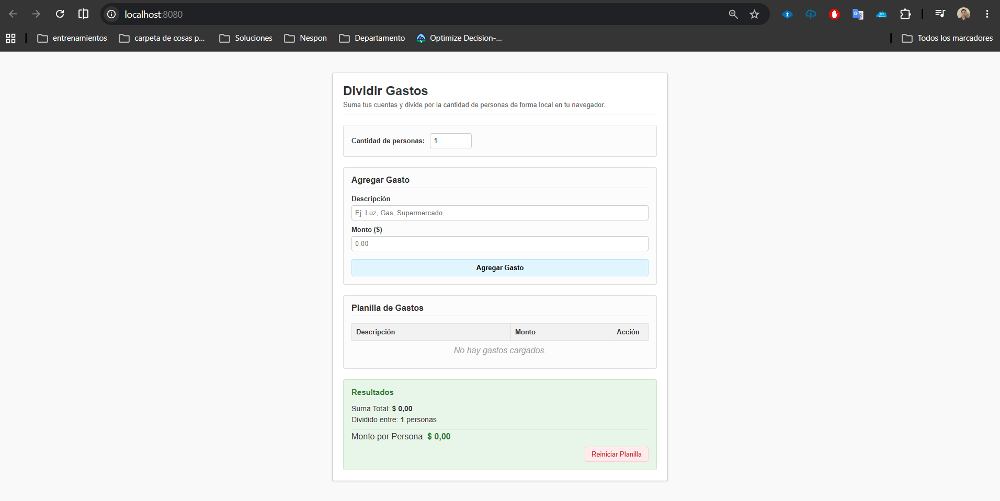

# 🧮 Calculadora de Gastos Básica



## Descripción

Esta es una calculadora de gastos básica que permite sumar los gastos de varias personas y dividir el total entre la cantidad de personas. Los datos se guardan en el localStorage del navegador.


## 🚀 Características

- **Simplicidad:** Interfaz intuitiva y fácil de usar.
- **Rapidez:** Resultados inmediatos.
- **Persistencia:** Los datos se guardan en el localStorage del navegador.

## 💻 Tecnologías Usadas

- **HTML5:** Estructura básica de la interfaz.
- **CSS3:** Estilo visual limpio y básico.
- **JavaScript (ES6):** Lógica del calculador y almacenamiento local (`localStorage`).

## 🛠️ Instalación y Ejecución

### Paso a paso para correr la aplicación en docker utilizando github.

**Paso 1-** Tener docker instalado y en ejecución en la pc.

**Paso 2-** Clonar el repositorio de GitHub:
```bash
git clone https://github.com/mateomackinson-wq/TP-IngenieriaDeSoftwareDockerApp.git
```

**Paso 3-** Abrir la consola de windows y entrar a la carpeta del proyecto:
```bash
cd TP-IngenieriaDeSoftwareDockerApp
```

**Paso 4-** Correr el comando que se encuentra debajo para construir la imagen de Docker localmente: (Docker leerá el Dockerfile local y empaquetará los archivos).
```bash
docker build -t calculadora-gastos .
```

**Paso 5-** Correr el comando que se encuentra debajo para ejecutar el contenedor.
```bash
docker run -d -p 8080:80 --name calculadora-app-local calculadora-gastos
```

**Paso 6-** Acceder a la aplicación, copiando el link de debajo en el navegador.
[http://localhost:8080](http://localhost:8080)

<br/>

### Paso a paso para correr la aplicación en docker utilizando Docker Hub.

> ⚠️ **NOTA:** Si corriste la versión utilizando github previamente, recordá detener y borrar el contenedor anterior con `docker rm -f calculadora-app-local` antes de continuar.

**Paso 1-** Tener docker instalado y en ejecución en la pc.

**Paso 2-** Ejecutar el contenedor directamente desde el repositorio de Docker Hub:
```bash
docker run -d -p 8080:80 --name calculadora-app-hub mmackinsonistea/calculadora-gastos:v1.0
```

**Paso 3-** Acceder a la aplicación, copiando el link de debajo en el navegador.
[http://localhost:8080](http://localhost:8080)

## 📝 Licencia

Este proyecto es de código abierto y está disponible bajo la licencia MIT.